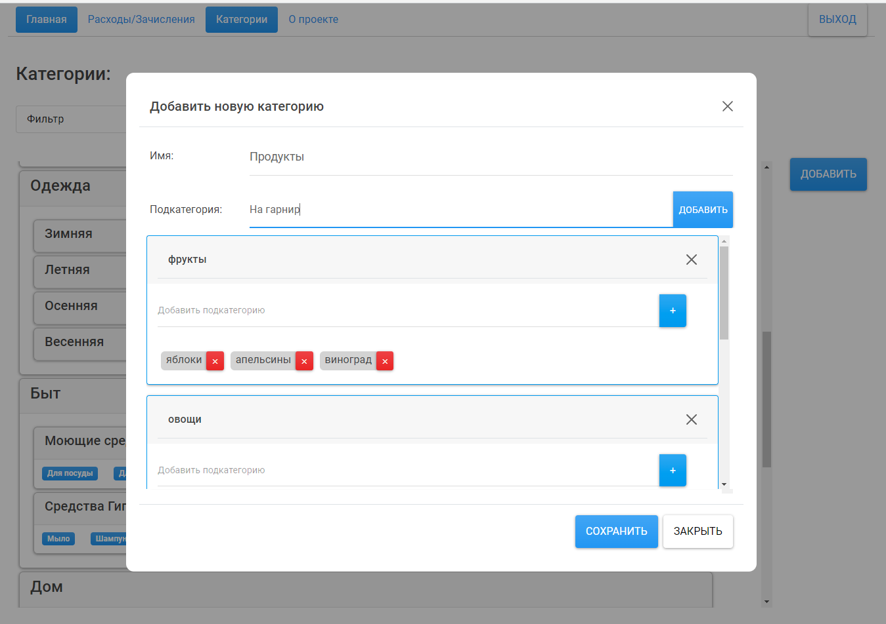

# Приложение учета расходов

Ссылка на приложение: [Expense-tracking-app][link-1]

## Описание:

После авторизации, в приложении, можно записывать свои расходы и доходы:

Данные отображаются на главной странице в виде графиков.
Фильтры позволяют выбрать какие операции показывать
(по умолчанию отображаются последние 20 операций):

Каждая запись имеет категорию и подкатегории. Вложенность подкатегорий: до 2.

Добавлять категории можно на странице категорий:

Все записи (категории, операции), можно редактировать и удалять нажав на неё.

На данный момент проект покрыт тестами:

| Statements                                                                 | Branches                                                            | Functions                                                             | Lines                                                            |
| -------------------------------------------------------------------------- | ------------------------------------------------------------------- | --------------------------------------------------------------------- | ---------------------------------------------------------------- |
|  |  |  |  |

[link-1]: https://paulmartynov.github.io/Expense-tracking-app/
